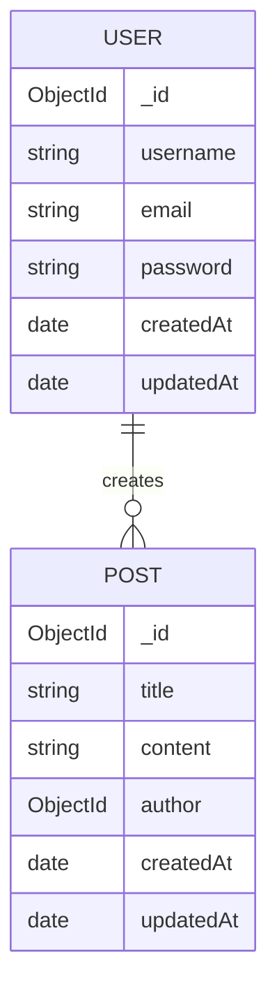

# Blog App

A full stack blog application with JWT authentication built with Node.js, Express, TypeScript, React, and MongoDB.

## Live Demo

- Frontend: https://blog-app-phi-weld.vercel.app
- Backend API: https://blog-app-nrg6.onrender.com

## Screenshots

### Home

<p align="center">
  
</p>

### Login

<p align="center">
  
</p>

### Posts

<p align="center">
  
</p>

## Features

- User registration and login with JWT authentication
- Create, read, and delete blog posts
- Protected routes — only logged-in users can create posts
- Authors can only delete their own posts
- Responsive navbar with auth state
- Clean CSS styling

## Tech Stack

**Backend:** Node.js, Express, TypeScript, MongoDB, Mongoose, bcryptjs, jsonwebtoken, Swagger/OpenAPI, Jest, Supertest

**Frontend:** React, TypeScript, Vite, React Router, Axios, Context API, Vitest, React Testing Library

## Deployment

- **Frontend:** Vercel
- **Backend:** Render
- **Database:** MongoDB Atlas

## Project Structure

```text
blog-app/
├── backend/
│   ├── src/
│   ├── tests/
│   └── package.json
├── frontend/
│   ├── src/
│   └── package.json
├── .github/
│   └── workflows/
└── README.md
```

## API Documentation

Interactive Swagger/OpenAPI documentation:

- **Local:** http://localhost:5000/api-docs
- **Production:** https://blog-app-nrg6.onrender.com/api-docs

## Entity Relationship Diagram (ERD)



## Testing

### Backend

- Jest
- Supertest
- MongoDB Memory Server
- Authentication API tests
- Posts API tests

### Frontend

- Vitest
- React Testing Library
- Navbar component tests

## Continuous Integration

GitHub Actions automatically runs on every push and pull request to the `main` branch.

### Backend CI

- Prettier
- ESLint
- TypeScript type checking
- Jest + Supertest
- Production build

### Frontend CI

- Prettier
- ESLint
- TypeScript type checking
- Vitest
- Production build

## Getting Started

### Backend

```bash
cd backend
npm install
npm run dev
```

### Frontend

```bash
cd frontend
npm install
npm run dev
```

## Environment Variables

For local development, create a `.env` file in the `backend/` folder:

```env
PORT=5000
MONGO_URI=mongodb://localhost:27017/blogapp
JWT_SECRET=your_secret_key
```

## API Endpoints

| Method | Endpoint | Access |
|--------|----------|--------|
| POST | /api/auth/register | Public |
| POST | /api/auth/login | Public |
| GET | /api/posts | Public |
| POST | /api/posts | Protected |
| DELETE | /api/posts/:id | Protected (author only) |

## Future Improvements

- Edit existing posts
- User profile page
- Comments system
- Image upload for posts
- Search functionality
- Pagination