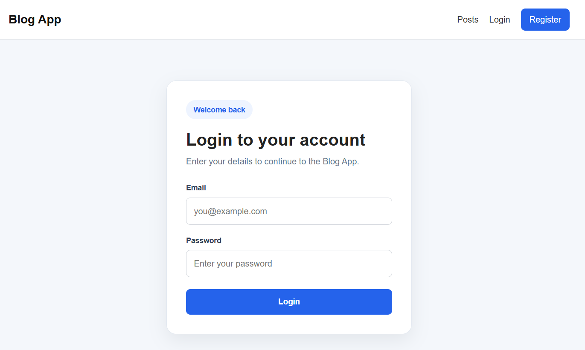
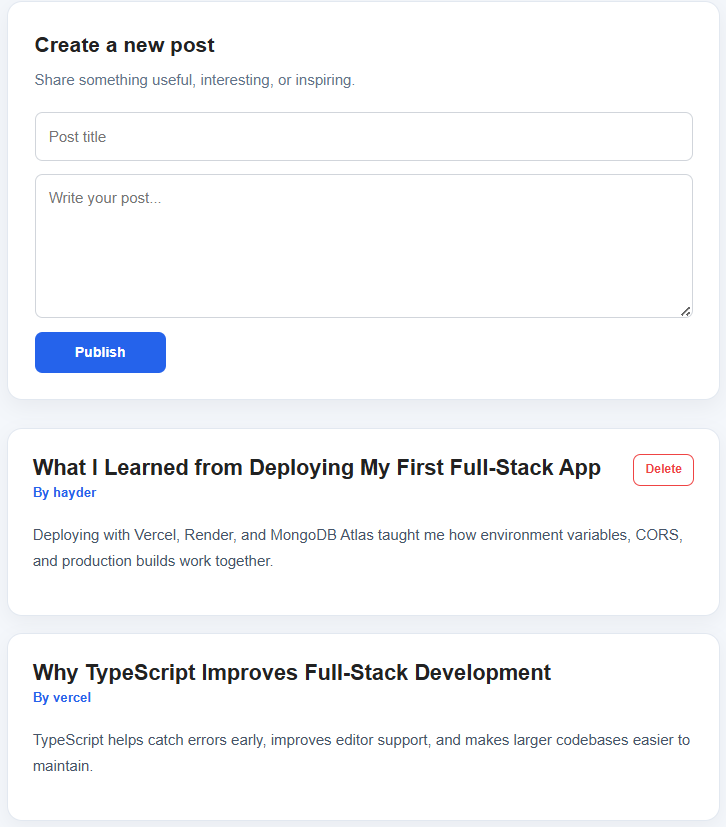
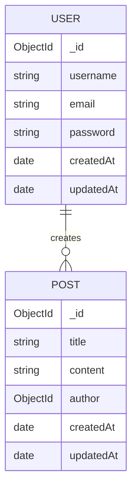

# Blog App


A full-stack blog application with JWT authentication built with Node.js, Express, TypeScript, React, and MongoDB.

## Live Demo

* **Frontend:** https://blog-app-phi-weld.vercel.app
* **Backend API:** https://blog-app-nrg6.onrender.com

## Screenshots

### Home

<p align="center">
  
</p>

### Login

<p align="center">
  
</p>

### Posts

<p align="center">
  
</p>

## Features

* User registration and login with JWT authentication
* Create, read, and delete blog posts
* Protected routes — only logged-in users can create posts
* Authors can only delete their own posts
* Responsive navbar with authentication state
* Interactive Swagger/OpenAPI documentation
* Backend API testing with Jest and Supertest
* Frontend component testing with Vitest and React Testing Library
* Automated CI with GitHub Actions

## Tech Stack

### Frontend

* React
* TypeScript
* Vite
* React Router
* Axios
* Context API

### Backend

* Node.js
* Express
* TypeScript
* MongoDB
* Mongoose
* bcryptjs
* jsonwebtoken
* Swagger / OpenAPI

### Testing

* Jest
* Supertest
* MongoDB Memory Server
* Vitest
* React Testing Library

### Deployment

* Vercel (Frontend)
* Render (Backend)
* MongoDB Atlas

### CI

* GitHub Actions

## Project Structure

```text
blog-app/
├── .github/
│   └── workflows/
│       ├── backend-ci.yml
│       └── frontend-ci.yml
├── backend/
│   ├── src/
│   ├── tests/
│   └── package.json
├── frontend/
│   ├── src/
│   └── package.json
└── README.md
```

## Architecture

```text
React Frontend
      │
      ▼
Axios (HTTP)
      │
      ▼
Express REST API
      │
      ▼
Mongoose
      │
      ▼
MongoDB Atlas
```

## API Documentation

Interactive Swagger/OpenAPI documentation:

* **Local:** http://localhost:5000/api-docs
* **Production:** https://blog-app-nrg6.onrender.com/api-docs

## Entity Relationship Diagram (ERD)



## Quick Start

### 1. Clone the repository

```bash
git clone https://github.com/hayderalhatemi/blog-app.git
cd blog-app
```

### 2. Backend

```bash
cd backend
npm install
npm run dev
```

### 3. Frontend

```bash
cd frontend
npm install
npm run dev
```

## Testing

### Backend

Automated API tests using Jest, Supertest, and MongoDB Memory Server.

Run the tests:

```bash
cd backend
npm test
```

Generate a coverage report:

```bash
npm test -- --coverage
```

Current test coverage includes:

* Authentication API
* Posts API

### Frontend

Automated component tests using Vitest and React Testing Library.

Run the tests:

```bash
cd frontend
npm test
```

Generate a coverage report:

```bash
npm test -- --coverage
```

Current test coverage includes:

* Navbar component

## Continuous Integration

GitHub Actions automatically runs on every push and pull request to the `main` branch.

### Backend CI

* Prettier
* ESLint
* TypeScript type checking
* Jest + Supertest
* Production build

### Frontend CI

* Prettier
* ESLint
* TypeScript type checking
* Vitest
* Production build

## Environment Variables

### Backend (`backend/.env`)

```env
PORT=5000
MONGO_URI=mongodb://localhost:27017/blogapp
JWT_SECRET=your_secret_key
```

### Frontend

No environment variables are required for local development unless you want to override the default API URL.

## API Endpoints

| Method | Endpoint             | Access                  |
| ------ | -------------------- | ----------------------- |
| POST   | `/api/auth/register` | Public                  |
| POST   | `/api/auth/login`    | Public                  |
| GET    | `/api/posts`         | Public                  |
| POST   | `/api/posts`         | Protected               |
| DELETE | `/api/posts/:id`     | Protected (Author only) |

## Future Improvements

* Edit existing posts
* User profile page
* Comments system
* Image upload for posts
* Search functionality
* Pagination

## Contributing

Contributions, suggestions, and feedback are welcome. Feel free to open an issue or submit a pull request.

## License

This project is licensed under the MIT License.
